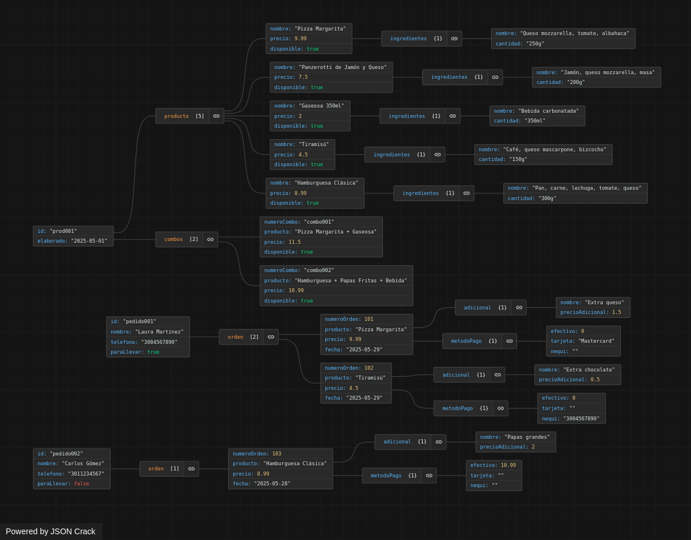

# Taller: Modelado NoSQL Documental con MongoDB para una Pizzería

🚨 No se espera un modelo "perfecto", sino que se **atrevan a explorar, justificar sus decisiones y aprender en el proceso**.

---

### Enunciado del reto

La pizzería necesita un sistema para gestionar sus productos (pizzas, panzarottis, bebidas, postres, adiciones), combos, ngredientes, pedidos y clientes. Los pedidos pueden ser para comer en el lugar o para recoger, y los clientes pueden personalizar sus productos con adiciones.

Debes **imaginar cómo guardarías esta información si no tuvieras que usar tablas como en MySQL, sino documentos JSON como los que usa MongoDB.**

⚠️ El enunciado es idéntico a su examen favorito de MySql 1

---

### 🚀 Actividades del reto

### 1. Investigar en equipo (máximo 3 personas)

Respondan brevemente en un documento o en el README del repositorio:

- ¿Qué es una base de datos NoSQL?
- ¿Qué es MongoDB?
- ¿Qué diferencia hay entre una base de datos relacional (como MySQL) y una base de datos documental como MongoDB?
- ¿Qué son documentos y colecciones en MongoDB?

> Pista: Un documento en MongoDB es un objeto tipo JSON con la información que quieres guardar, como si fuera una ficha de algo (por ejemplo, una pizza, un pedido o un cliente).
> 

---

### 2. Diseñar su propuesta

- Imaginen y propongan **qué colecciones tendrían**.
- ¿Qué información tendría un documento de pedido? ¿Y un producto?
- ¿Qué iría dentro del documento y qué se referenciaría?
- ¿Qué campos serían listas, objetos u otros documentos incrustados?

> Por ejemplo: ¿Un pedido tendría todos los datos del cliente y los productos adentro, o solo un ID del cliente?
> 

Usen cualquier herramienta para dibujar (a mano, draw.io, papel y foto), o escriban ejemplos de documentos en formato JSON.

---

### 3. Crear ejemplos de documentos JSON

Creen al menos 3 documentos de ejemplo escritos a mano o con ayuda de un validador JSON online, que representen:

- Un producto (ej. pizza con ingredientes)
- Un combo
- Un pedido con un cliente y varios productos (algunos personalizados)

---

### 4. Reflexionar

En grupo, escriban una breve reflexión:

- ¿Qué fue lo más difícil de imaginar sin tablas?
- ¿Qué les gustó del enfoque con documentos?
- ¿Qué dudas les surgieron al pensar en este nuevo tipo de base de datos?

---

### 📦 Entregable

Un **repositorio en GitHub** con:

- Un `README.md` que incluya:
    - Las respuestas de la investigación
    - El diseño propuesto con explicación de las colecciones y su estructura
    - Los ejemplos de documentos JSON (pueden ir en el mismo README o en archivos aparte)
    - La reflexión grupal

---

# Respuestas:
1. 
    **¿que es una base de datos NoSQL?**

    Una base de datos NoSQL (acrónimo de "no solo SQL") es un sistema de gestión de bases de datos no relacional que almacena datos en un formato no    tabular, a diferencia de las bases de datos relacionales que utilizan tablas para organizar la información. 

    En otras palabras, las bases de datos NoSQL ofrecen una alternativa a las bases de datos relacionales (SQL) al permitir almacenar y recuperar   datos en formatos más flexibles, como documentos, pares clave-valor, o grafos. Estas bases de datos son ideales para aplicaciones que manejan     grandes volúmenes de datos no estructurados o semiestructurados y que requieren flexibilidad en el esquema de datos.

    ---

    **¿Qué es MongoDB?**

    MongoDB es una base de datos NoSQL de código abierto y ampliamente utilizada que guarda la información en un formato flexible conocido como     documentos. A diferencia de las bases de datos relacionales convencionales que emplean tablas, MongoDB organiza los datos en colecciones de     documentos JSON, lo que facilita su modificación. Es especialmente adecuado para aplicaciones que requieren almacenar grandes volúmenes de datos    semiestructurados o no estructurados, y ofrece funcionalidades como replicación, particionamiento y una amplia variedad de lenguajes de consulta.

    --- 

    **¿Qué diferencia hay entre una base de datos relacional (como MySQL) y una base de datos documental como MongoDB?**

    Las bases de datos relacionales estructuran sus datos mediante tablas, lo que implica el uso de un esquema fijo. Para establecer relaciones entre   datos, utilizan joins entre diferentes tablas. Este tipo de base de datos es ideal para aplicaciones financieras y sistemas donde la integridad y     consistencia de los datos son fundamentales. Sin embargo, su capacidad de crecimiento está limitada por la potencia del hardware en el que se   ejecutan, lo que se conoce como escalabilidad vertical.

    Por otro lado, las bases de datos documentales gestionan la información a través de documentos en formato JSON, que internamente son procesados     como BSON. Gracias a su esquema flexible, permiten almacenar distintos tipos de datos dentro de un mismo documento, lo que facilita relaciones  embebidas y una estructura no relacional. Este enfoque es más adecuado para el desarrollo de aplicaciones web modernas, donde la flexibilidad y  el rendimiento son clave. Además, estas bases de datos escalan de manera horizontal, lo que significa que pueden distribuirse y sincronizarse    entre múltiples servidores, sin estar limitadas por el hardware de una sola máquina. 

    ---

    **¿Qué son documentos y colecciones en MongoDB?**

    En MongoDB, los documentos y las colecciones son dos conceptos fundamentales en su modelo de datos, que es basado en JSON (JavaScript Object    Notation) y es de tipo NoSQL. Te explico cada uno a continuación:

    **Documento:**

    Un documento es la unidad básica de almacenamiento en MongoDB. Es un registro o una entrada que contiene datos estructurados. En lugar de las   filas de una base de datos relacional, los documentos en MongoDB son objetos BSON (Binary JSON), que es una representación binaria de JSON.

    Un documento puede contener cualquier cantidad de campos, y estos campos pueden ser de cualquier tipo: cadenas de texto, números, fechas, listas,   e incluso otros documentos (lo que lo hace muy flexible).

    En este ejemplo:

    El campo _id es obligatorio y es un identificador único.

    Los campos nombre, edad, direccion y telefonos pueden contener distintos tipos de datos, como cadenas de texto, números y objetos anidados.

    **Colección:**

    Una colección es un conjunto de documentos en MongoDB. Es similar a lo que sería una tabla en una base de datos relacional, pero en MongoDB no  hay un esquema rígido que defina los documentos de la colección. Es decir, los documentos dentro de una misma colección pueden tener diferentes  estructuras, lo que proporciona gran flexibilidad.

    Las colecciones no tienen un esquema fijo, y pueden almacenar documentos con diferentes campos.

    No se requiere una definición previa de la colección; MongoDB la crea automáticamente cuando insertas el primer documento.

    Ejemplo:
    Supón que tienes una colección llamada clientes, que puede contener documentos como el que mostramos antes (el de Juan Pérez). Pero en esa misma    colección también podrías tener documentos con diferente estructura, para ver como seria el codigo puedes ir al final de esta pregunta :

    Aquí, el documento tiene campos diferentes y no incluye el campo direccion o telefonos, pero aún así está en la misma colección clientes.

    Resumen:
    Documento: Es un objeto individual (similar a una fila en una base de datos relacional) que contiene datos, y puede tener una estructura flexible.

    Colección: Es un conjunto de documentos relacionados, similar a una tabla, pero sin un esquema fijo que defina todos los documentos de la   colección.

    MongoDB es muy flexible en cuanto a la estructura de los datos, lo que lo hace ideal para aplicaciones donde los datos pueden variar o cambiar  con el tiempo.

    [Ejemplo de Documento y de colecciones](documentos_colecciones_mongoDB.json)

2. - Imaginen y propongan **qué colecciones tendrían**.
    - ¿Qué información tendría un documento de pedido? ¿Y un producto?
    - ¿Qué iría dentro del documento y qué se referenciaría?
    - ¿Qué campos serían listas, objetos u otros documentos     incrustados?

🗂️ Estructura general del JSON
El archivo contiene un array de dos objetos, y cada objeto representa un ejemplo de documento que pertenecen a dos colecciones diferentes en MongoDB:

Colección: productos

Colección: pedido

Esto simula cómo serían los documentos que se insertan en cada colección.

📦 Colección: productos
Documento de ejemplo:
json
Copiar
Editar
{
  "id": "",
  "elaborado": "",
  "producto": [
    {
      "nombre": "",
      "precio": "",
      "disponible": "",
      "ingredientes": {
        "nombre": "",
        "cantidad": ""
      }
    }
  ],
  "combos": [
    {
      "numeroCombo": "",
      "producto": "",
      "precio": "",
      "disponible": ""
    }
  ]
}
🔍 ¿Qué representa?
Un producto elaborado, con campos vacíos como plantilla.

Incluye un arreglo llamado producto que puede contener múltiples productos individuales.

Cada producto tiene:

Nombre

Precio

Disponibilidad

Ingredientes (como subdocumento)

También hay un arreglo de combos, que representa ofertas o combinaciones de productos.

✅ Esta estructura es útil para:
Restaurantes o tiendas que venden productos con ingredientes y combos.

Modelar productos con subcomponentes y ofertas especiales.

📦 Colección: pedido
Documento de ejemplo:
json
Copiar
Editar
{
  "id": "",
  "nombre": "",
  "telefono": "",
  "orden": [
    {
      "numeroOrden": 0,
      "producto": "",
      "precio": 0,
      "fecha": "",
      "adicional": {
        "nombre": "",
        "precioAdicional": 0
      },
      "metodoPago": {
        "efectivo": 0,
        "tarjeta": "",
        "nequi": "telefono"
      }
    }
  ]
}
🔍 ¿Qué representa?
Un pedido realizado por un cliente.

Contiene:

Identificación del cliente (id, nombre, telefono)

Un arreglo de orden, donde cada elemento representa un producto solicitado.

Dentro de cada orden se incluyen:

Detalles del producto

Precio

Fecha

Opcionales (adicional) como extra queso, bebida, etc.

Método de pago (efectivo, tarjeta o Nequi)

✅ Esta estructura es útil para:
Sistemas de pedidos en línea.

Seguimiento de ventas y métodos de pago.

Registrar múltiples pedidos por cliente.

📝 Nota técnica
Los campos "coleccion_producto" y "coleccion_pedido" actúan como comentarios embebidos, pero no son necesarios ni recomendados en documentos reales de MongoDB.

En MongoDB, cada archivo debería contener solo documentos de una colección para facilitar la importación.

✅ En resumen:
Elemento	Descripción
Colección productos	Contiene documentos con productos, sus ingredientes y combos.
Colección pedido	Contiene documentos con pedidos de clientes, incluyendo órdenes, precios, y formas de pago.
Estructura	Cada documento puede tener subdocumentos y arreglos, lo cual es natural en MongoDB.
Uso	Modelo típico en sistemas de ventas, restaurantes, e-commerce.

[Ejemplo de Documento y de colecciones](2.json)

---

3. Creen al menos 3 documentos de ejemplo escritos a mano o con ayuda de un validador JSON online, que representen:

- Un producto (ej. pizza con ingredientes)
- Un combo
- Un pedido con un cliente y varios productos (algunos personalizados)

[Creacion ejemplos de documentos JSON](3.json) 

---

4. 
**¿Qué fue lo más difícil de imaginar sin tablas?**

Las relaciones.

**¿Qué les gustó del enfoque con documentos?**

Que es infinitamente mas sencillo que **SQL** obviamente cuando uno practica.

**¿Qué dudas les surgieron al pensar en este nuevo tipo de base de datos?**

La mas relevante fue si se podian hacer colecciones dentro de colecciones. Y al principio no entendimos bien que era una coleccion y que era un documento para aclarar nuestras ideas le pedimos una opinion a nuestro profesor.